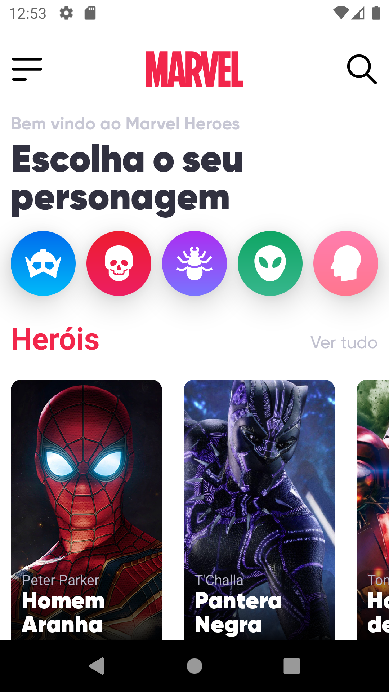
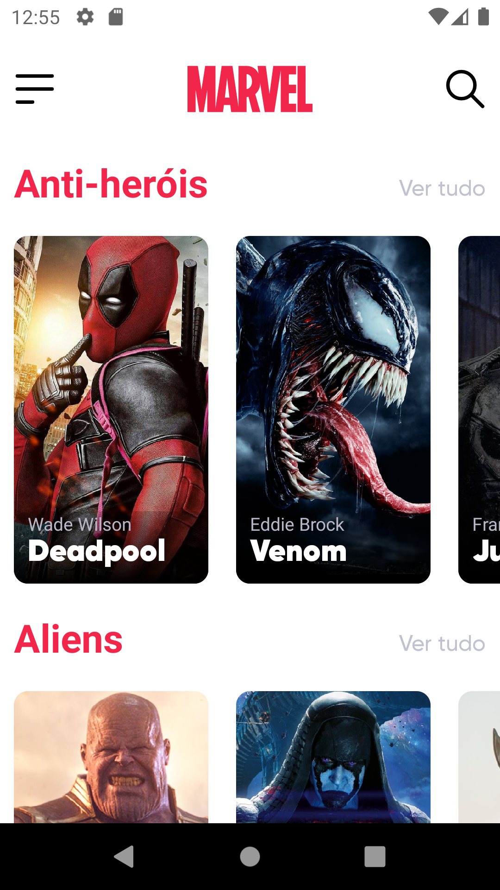
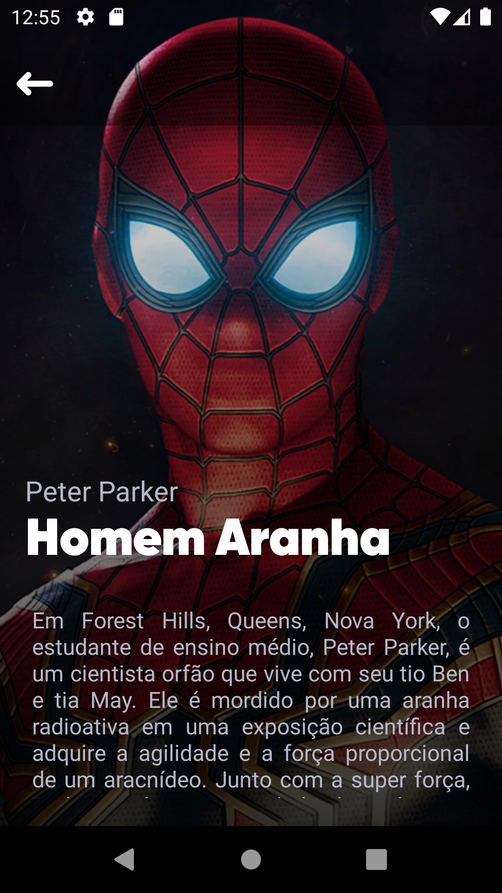
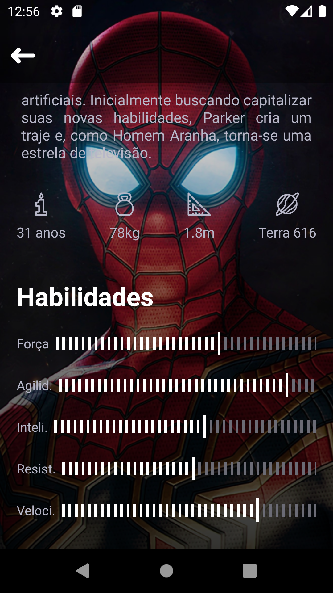

# marvelHeroes :bomb:
Desafio da DevChallenge - Aplicativo para visualizar heróis da Marvel - Design feito por Umpontoseis.

Link do desafio: https://github.com/Lorenalgm/marvel-heroes

O projeto foi feito com o propósito de estudar listagem de dados e navegação entre telas com React Native. Utilizei no projeto algumas dependências como: react-navigation, react-native-linear-gradient e react-native-svg.

## Imagens do projeto: :iphone:
<div>




</div>

## Clonando o repositório :rocket:
```bash
# Clone este repositório
$ git clone https://github.com/rafaellore/marvelHeroes

# Acesse a pasta do projeto no terminal/cmd
$ cd marvelHeroes

# Instale as dependências
$ yarn install

# Execute o bundle da aplicação
$ yarn start

# Abra um segundo terminal e instale a aplicação no seu emulador android
$ yarn android

```
